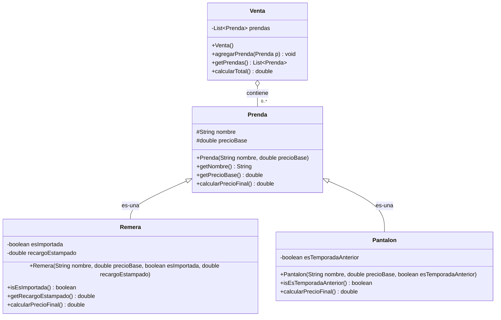

# Práctica Clase 6: Tienda de Ropa y Precios Polimórficos

¡Bienvenido/a al proyecto práctico de la **Clase 6: Herencia y Polimorfismo**!

Este proyecto está configurado para utilizar el **build nativo de IntelliJ IDEA** con **Java 17** y pruebas automatizadas en **JUnit 5**.

---

## 🛠️ Configuración en IntelliJ IDEA

1. **Abrir el proyecto:**
   - En IntelliJ IDEA: `File` -> `Open...` -> Seleccionar la carpeta `proyecto-estudiantes-clase-06` (o el repositorio clonado).
2. **Verificar el JDK 17:**
   - Ir a `File` -> `Project Structure...` -> `Project`.
   - Asegurarse de que en **SDK** esté seleccionado **Java 17** (o añadirlo si no figura).
   - Verificar que **Language level** esté en `17 - Sealed types, always-strict floating-point, etc.`.
3. **Librería de Pruebas (JUnit 5):**
   - El proyecto ya tiene configurada la dependencia de módulo con `JUnit 5.8.1`.
   - Si al abrir la clase `VentaTest.java` IntelliJ subraya en rojo los imports de `@Test`, posicionate sobre la palabra en rojo, presioná `Alt + Enter` y seleccioná:
     > *"Add 'JUnit5.8.1' to classpath"*.

---

## 📐 Diagrama de Clases (UML)

---

## 🎯 Tu Misión en este Ejercicio

En este ejercicio aplicamos la **Herencia** y el **Polimorfismo de Inclusión** para eliminar condicionales de tipo (*code smells*) y respetar el **Principio de Sustitución de Liskov (LSP)**.

### Estado Inicial del Código
* `Prenda.java`: Implementada al 100% como superclase base del catálogo.
* `Remera.java`: Implementada al 100% y comentada para que la uses como **modelo de referencia**.
* `Pantalon.java`: Estructurada con comentarios `// TODO` para que completes la herencia y el cálculo con 10% de descuento.
* `Venta.java`: Estructurada con un comentario `// TODO` en `calcularTotal()`.
* `VentaTest.java`: Batería de pruebas unitarias listas para ejecutar.

### Pasos para Resolver:
1. Abrí `tests/ar/edu/unlu/poo/tienda/VentaTest.java` y ejecutá todos los tests (`Ctrl + Shift + F10`).
   - Notarás que los tests de `Remera` están en **VERDE**.
   - Los tests de `Pantalon` y `Venta` están en **ROJO**.
2. Abrí `Pantalon.java` y completá los dos bloques `// TODO`:
   - Invocá al constructor del padre con `super(...)`.
   - Sobreescribí `@Override public double calcularPrecioFinal()` reutilizando `super.calcularPrecioFinal()`.
3. Abrí `Venta.java` y completá `calcularTotal()`:
   - Iterá sobre `prendas` invocando polimórficamente `p.calcularPrecioFinal()`.
   - ⚠️ **RESTRICCIÓN:** Está terminantemente prohibido usar `instanceof`, `getClass()` o `switch`.
4. Volvé a correr `VentaTest.java` hasta que **todos los tests pasen a VERDE**.

---

## ❓ Preguntas de Autoevaluación

Al finalizar, respondé estas preguntas antes de pasar al Ejercicio 2:
1. ¿Por qué la clase `Venta` no necesita ser modificada si mañana agregamos una clase `Campera extends Prenda`?
2. ¿De qué manera el Principio de Sustitución de Liskov (LSP) garantiza que `Venta` pueda tratar a cualquier `Prenda` de forma segura?
